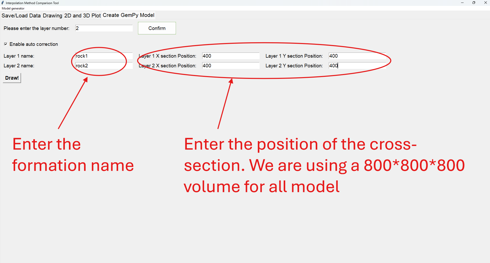
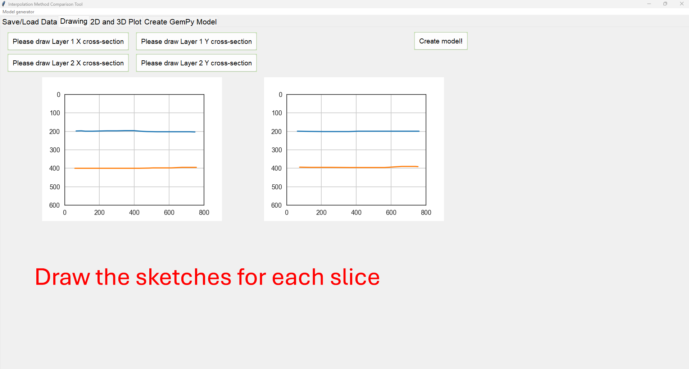

# GemPy_sketches_to_model
a small tool that let you creat gempy model from sketches
## There are two tools in this repo:
- a sketches-to-model generator with GUI(tkinter)
- a sketches-to-data generator (2D to 2.5D)
## How to use
- sketches-to-model generator with GUI

- sketches-to-data generator (2D to 2.5D)

